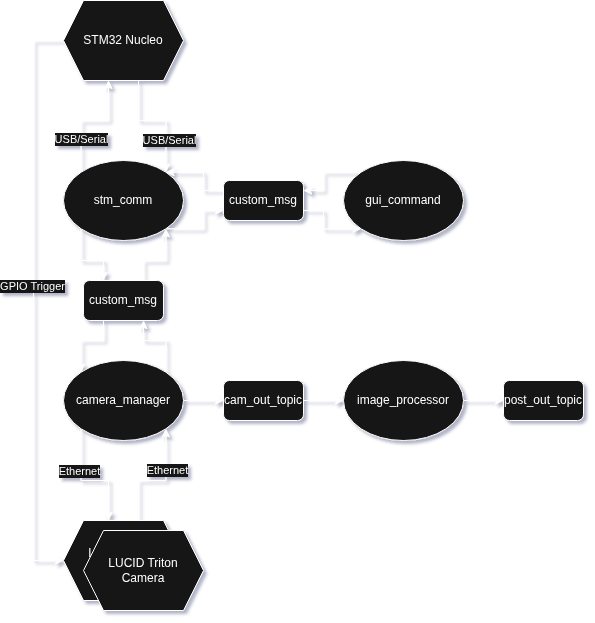

# ROS2_Stereo_Project

This repository is the main one for the stereo-vision project, it includes several other repositories and the files to set up the entire project

## Project Architecture
Nodes are ellipse, squares are topics and messages, unspecified arrows are ros communications, hexagones are hardware  



## STM32 Nucleo Case

The 2 part case files are in nucleo_case

## Dependencies

- [ROS2 Humble](https://docs.ros.org/en/humble/index.html)
- [LUCID Arena SDK](https://thinklucid.com/downloads-hub/)
- [Libserial](https://github.com/crayzeewulf/libserial)
- [OpenCV with CUDA](https://opencv.org/) [tutorial](https://medium.com/@amosstaileyyoung/build-opencv-with-dnn-and-cuda-for-gpu-accelerated-face-detection-27a3cdc7e9ce)
- [ROS2_LUCID_Triton_camera_driver](https://github.com/The-Last-Resort-FR/ROS2_LUCID_Triton_camera_driver)
- [ROS2_STM32_Comm](https://github.com/The-Last-Resort-FR/ROS2_STM32_Comm)
- [ROS2_Custom_Msg](https://github.com/The-Last-Resort-FR/ROS2_Custom_Msg)
- [ROS2_Command_Tester](https://github.com/The-Last-Resort-FR/ROS2_Command_Tester)
- [ROS2_Image_Processing](https://github.com/The-Last-Resort-FR/ROS2_Image_Processing)
- [STM32_USB_Comm](https://github.com/The-Last-Resort-FR/STM32_USB_Comm)  
  
No need to clone all the repositories, they are included as submodules  
STM32_USB_Comm needs to be compiled and flashed on an stm32 using the STM32 toolchain  
Libserial will be installed by setup.sh

## Install

Run the setup :  
```bash
sudo ./misc/setup.sh
```
Build the packages :  
```bash
./misc/build.sh
```

## Execute the nodes

To execute the nodes directly do :
```bash
sudo ./run.sh
```

## Install the nodes

/!\ Under construction
To install the project do :
```bash
sudo ./install.sh
```
Then you can start them and manage them as services  
To run the whole chain you can do :  
```bash
sudo systemctl start image_processing
```
/!\ Under construction

## Test commands

If you want to test some commands you can use the gui_command node :  
```bash
ros2 run gui_command gui_command
```